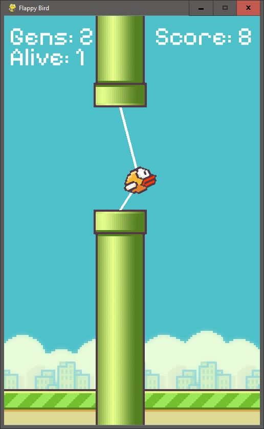

# Flappy Bird with NEAT (NeuroEvolution of Augmenting Topologies)

This project implements the classic **Flappy Bird** game using **NEAT** (NeuroEvolution of Augmenting Topologies) to evolve intelligent agents that learn to play the game autonomously. The agents (birds) are trained using genetic algorithms to control their movement, avoiding obstacles (pipes) and maximizing their score.

## **Overview**
In this game, the bird must avoid pipes by either flying upwards or falling downward. The bird's actions are controlled by an artificial neural network (ANN) that evolves over generations using NEAT. As the generations progress, the neural networks get better at playing, and the birds are able to avoid pipes for longer periods of time.

  
  
<em>This is an instance of the the Flappy Bird AI in action.</em>

## **Project Structure**

### **1. Main Script (`main.py`)**
The `main.py` script serves as the entry point of the game:
- **Game Initialization:** Sets up the window, bird images, pipe images, background, base, font, and other game-related configurations.
- **NEAT Integration:** Initializes the NEAT configuration and creates the population. Each bird's actions are controlled by an evolving neural network.
- **Game Loop:** Handles the game logic:
  - The bird's movement is controlled by the neural network based on input (bird's position relative to the pipes).
  - Pipes are generated dynamically, and birds are scored for passing pipes.
  - The game ends when a bird collides with a pipe or the ground.

### **2. Bird (`bird.py`)**
The `Bird` class defines the behavior of the bird:
- **Attributes:** 
  - `max_rotation`, `rot_vel`, `ani_time` control the bird's appearance and movement.
  - `x`, `y`, `vel`, and `tilt` define the bird's position, velocity, and rotation.
- **Methods:** 
  - `jump()`: Makes the bird jump upwards (triggered by the neural network).
  - `move()`: Calculates the bird's movement due to gravity and applies tilt to simulate natural movement.
  - `draw()`: Draws the bird on the screen with the appropriate animation.
  
### **3. Pipe (`pipe.py`)**
The `Pipe` class defines the behavior of the obstacles:
- **Attributes:**
  - `gap`: Defines the gap between the top and bottom pipes.
  - `vel`: Defines the speed at which pipes move toward the bird.
  - `top`, `bottom`: Define the positions of the top and bottom pipes.
- **Methods:**
  - `set_height()`: Randomly sets the height for the pipe.
  - `move()`: Moves the pipe leftward across the screen.
  - `draw()`: Draws the pipe on the screen.
  - `collide()`: Checks if the bird collides with either the top or bottom pipe.

### **4. Base (`base.py`)**
The `Base` class defines the ground at the bottom of the screen:
- **Attributes:**
  - `vel`: Defines the speed at which the ground moves.
  - `width`: The width of the ground image.
- **Methods:**
  - `move()`: Moves the base image across the screen and loops it when it goes off-screen.
  - `draw()`: Draws the base on the screen.

### **5. NEAT Integration (`eval_genomes()`)**
The **NEAT** algorithm is used to evolve neural networks for the birds:
- **Generation Handling:** The game runs for multiple generations of birds. Each bird is assigned a fitness score based on how long it survives and how many pipes it passes.
- **Neural Network Activation:** Each bird's neural network outputs an action (flap or not) based on its position and the proximity of pipes.
- **Fitness Evaluation:** The bird's fitness score is updated based on its actions and survival.

## **Gameplay Dynamics**
1. **Bird Movement:** The bird is controlled by a neural network that outputs whether the bird should "jump" (flap) based on its current vertical position and the proximity of pipes.
2. **Pipes:** Pipes are generated dynamically and move from right to left. The bird needs to avoid colliding with them to continue.
3. **Scoring:** The score increases as the bird successfully passes through pipes.
4. **Game Over:** If the bird collides with a pipe or the ground, it is removed from the simulation, and its fitness is penalized.
5. **Evolution:** After each generation, the best-performing birds are selected to reproduce, creating new neural networks for the next generation of birds.
